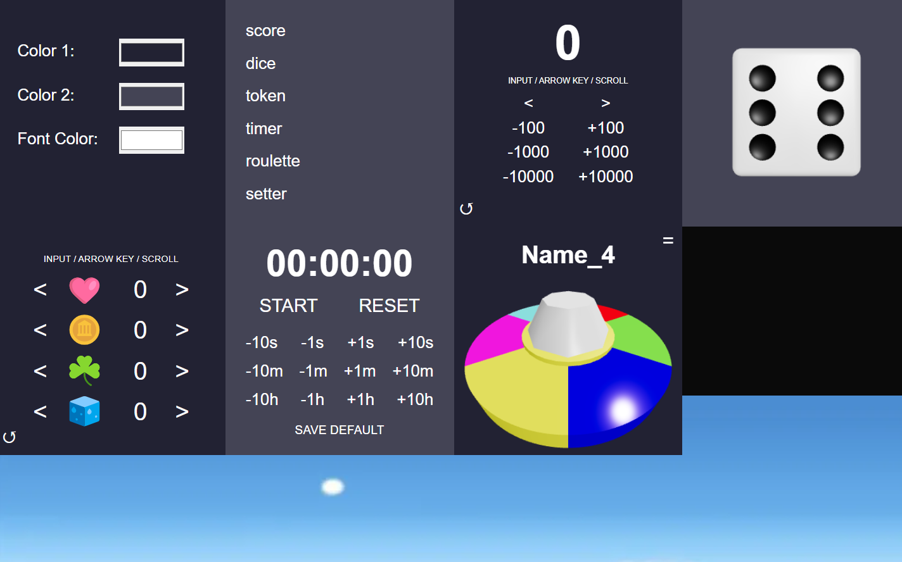

## 目的
ボドゲ等を遊ぶ時のダイス、トークン、勝利点等を表示するためのアプリを作成する。
当面は Cloudflare Pages にデプロイ。

https://boardgamefan.pages.dev/



## 開発作業

### 開発メモ
- 基本的にほぼすべてのレンダリングはクライアント側で行うが、TOPの layout.tsx だけはサーバーサイドで行う。

### 初期導入・ライブラリインストール
1. `npx create-next-app`
2. `npm install three @react-three/fiber`
3. `npm i @react-three/drei`
4. `npm run dev`

### 開発中に使うスクリプト
- ローカルストレージ削除（Chrome コンソール） `localStorage.clear()`
- ローカルストレージ閲覧（Chrome コンソール） `console.log(localStorage)`
- デプロイ前にビルドエラーを確認 `npm run lint`

### 本番ビルド関係
1. 今回は Cloudflare Pages にデプロイするため静的ファイルを生成する
   1. next.config.js に `output: 'export'` を追加
2. `npm run build`

### インフラ
Cloudflare Pages にデプロイ

1. Cloudflare Pages にログイン
2. リポジトリを選択（すべてのリポジトリも選択できたがしなかった）
3. ビルドコマンドを `npm run build` に設定
4. 出力ディレクトリを `out` に設定

## 改善点
- AI のさらなる積極利用
- 大規模リファクタリング
  - 関数等の記述方法を統一
- セキュリティ向上
  - ローカルストレージ暗号キーをハードコーディングからサーバー管理に移管
  - CSP を追加
- 追加カード
  - 投票システム（要バックエンドサーバー）
  - チーム分け（要バックエンドサーバー）
  - 20 面ダイス
- UI 改善
  - サウンドエフェクト追加
  - 紙吹雪追加
  - SP のフォントを正しく動作するように修正

## 参考URL
- react-three-fiber, drei などの紹介
  - あくまで紹介記事、導入のイメージ把握に使用
  - https://zenn.dev/solb/articles/d25e664154cc0c
  - https://hack.nikkei.com/blog/advent20231207/
- Tailwind ドキュメント
  - https://tailwindcss.com/docs
- ReactThreeFiber ドキュメント
  - 対して参考にならない・・・？
  - https://r3f.docs.pmnd.rs/getting-started/introduction
- Drei ドキュメント
  - ドキュメントとしての用途もだが、サンプルコードが多く掲載されており助かる
  - https://drei.docs.pmnd.rs/getting-started/introduction
- Three.js ドキュメント
  - 結局詳細な設定内容はここで確認することになる
  - https://threejs.org/docs/index.html
- Cloudflare Pages 紹介記事
  - これだけでデプロイまでできてしまった
  - https://zenn.dev/rivine/articles/2023-06-23-deploy-hugo-to-cloudflare-pages
- Cloudflare Pages Docs
  - デプロイが簡単にできすぎて全然読んでないが、かなり見やすそう
  - https://developers.cloudflare.com/pages/
- デザイン系
  - https://colorhunt.co/

## AI の使い方メモ
Copilot Chat や Copilot Workspace を積極的に使用する。
```
リファクタリングがしたいです。 セキュリティ的に問題がある場所もっと効率的に書ける場所があったら教えてください

コードの提示は修正箇所のみでいいです。
```
