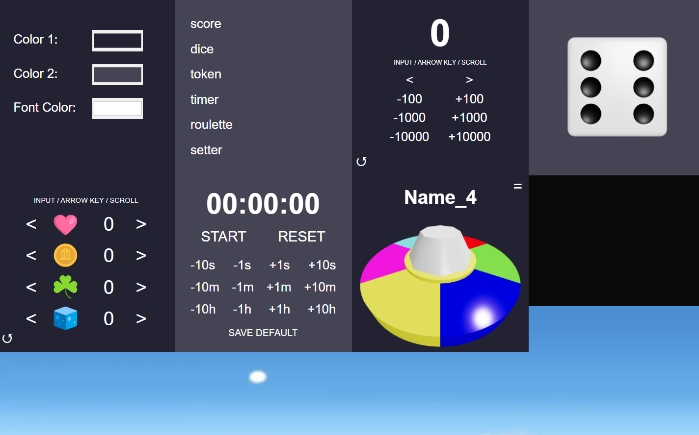

# Game Tools!

ボドゲ・カードゲームなどで使うダイス・トークン・勝利点などを、画面上でまとめて操作できるツールです。

配信・対面プレイのどちらでも使いやすいよう、PC ではグリッド配置、スマートフォンではスワイプ切替に対応しています。

**デモ:** https://boardgamefan.pages.dev/



---

## できること

| カード | 内容 |
| --- | --- |
| Dice | 6 面 / 20 面の 3D ダイス |
| Coin | 3D コイントス |
| Roulette | プレイヤー色で分割するルーレット |
| Timer | カウントダウンタイマー |
| Stopwatch | ストップウォッチ（ラップ記録対応） |
| Token / Score / OneOnOne | 各種カウンター |
| Turn / Winner | ターン・勝利数管理 |
| Player / Style | プレイヤー・見た目の設定 |

設定（カード配置・スタイル・プレイヤー）はブラウザのローカルストレージに保存されます。

---

## 開発環境

### 必要環境

- Node.js 18 以上（推奨: 20 LTS）
- npm

### セットアップ

```bash
npm install
npm run dev
```

ブラウザで http://localhost:3000 を開きます。

### 主なスクリプト

| コマンド | 用途 |
| --- | --- |
| `npm run dev` | 開発サーバー起動 |
| `npm run lint` | ESLint 実行 |
| `npm run build` | 静的書き出し（`out/`） |
| `npm start` | ビルド後のプレビュー |

### ローカルストレージの確認（Chrome コンソール）

```js
localStorage.clear()   // 全削除
console.log(localStorage)
```

---

## 構成のポイント

- **レンダリング:** ほぼすべてクライアント側。`app/layout.tsx` のみサーバーコンポーネント。
- **3D:** `@react-three/fiber` / `@react-three/drei` / `three`
- **スタイル:** Tailwind CSS
- **パスエイリアス:** `@/` → リポジトリルート
- **SP 判定:** 画面幅 500px 未満で `GridSP`、それ以上で `Grid`

```
app/                 # Next.js App Router
components/
  Grid.tsx           # PC グリッド
  GridSP.tsx         # SP スワイプ
  card/              # 各ツールカード
  card/module/       # 共通 UI（ドラッグ・閉じる・リセット）
hooks/               # 共通フック（長押しなど）
utils/               # 型・定数・localStorage・グリッド計算
public/              # 3D モデル・アイコン・マニフェスト
```

---

## デプロイ（Cloudflare Pages）

本リポジトリは静的エクスポート前提です（`next.config.mjs` の `output: "export"`）。

1. Cloudflare Pages でリポジトリを連携
2. ビルドコマンド: `npm run build`
3. 出力ディレクトリ: `out`

---

## 今後の改善候補

- 投票・チーム分けなど、バックエンドが必要な機能
- 効果音・紙吹雪などの演出
- CSP の強化（現状は静的ホスト＋ローカル設定のみ）

---

## 参考リンク

- [React Three Fiber](https://r3f.docs.pmnd.rs/getting-started/introduction)
- [Drei](https://drei.docs.pmnd.rs/getting-started/introduction)
- [Three.js Docs](https://threejs.org/docs/index.html)
- [Tailwind CSS](https://tailwindcss.com/docs)
- [Cloudflare Pages Docs](https://developers.cloudflare.com/pages/)
